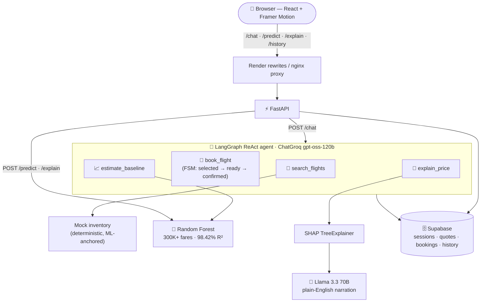
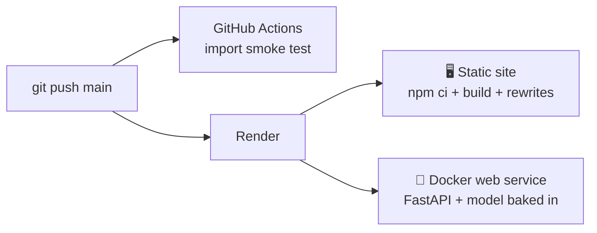

<div align="center">

# ✈️ FairFare

### The AI flight agent that knows what a fair fare is


<br/>

[](https://flight-predictor-v2-frontend.onrender.com)
&nbsp;
[](https://flight-predictor-v2-backend.onrender.com/docs)

<br/>

[](https://python.org)
[](https://fastapi.tiangolo.com)
[](https://langchain-ai.github.io/langgraph/)
[](https://groq.com)
[](https://react.dev)
[](https://scikit-learn.org)
[](https://shap.readthedocs.io)
[](https://supabase.com)
[](https://playwright.dev)
[](https://render.com)

[](https://github.com/SHAIKH-AKBAR-ALI/flight-predictor-v2/stargazers)
[](https://github.com/SHAIKH-AKBAR-ALI/flight-predictor-v2/actions)

</div>

---

## 🧠 What is this?

A conversational **AI booking agent** for Indian domestic flights with a superpower: it knows what every route *should* cost.

You talk to it like a travel agent. Behind the scenes, a **LangGraph agent** on Groq searches live options, compares each fare against a **Random Forest model trained on 300,000+ real fares** (98.42% R²), explains price drivers with **SHAP + Llama 3.3**, and walks you through a full booking — passenger details, confirmation, boarding pass.

> **₹8,145 means nothing. "₹2,100 above typical for this route" is a decision.**

```
You    : find flights Delhi to Mumbai on July 25
Agent  : 9 live options, cheapest first: AirAsia I5-439 at ₹8,145 (Early Morning, 1 stop)…
         Typical price for this route is ₹6,045, so today is running above usual.
You    : book the cheapest one
Agent  : AirAsia I5-439 it is. Passenger name and email?
You    : Akbar Ali, akbar@example.com
Agent  : Booked ✅ Confirmation FLA119AEAF — Delhi → Mumbai, Jul 25, ₹8,145.
```

*Real session, real confirmation ID stored in Supabase. Bookings are simulated (mock inventory + mock payment) — this is a portfolio build, not a travel agency.*

---

## 🏗️ Architecture



**Design rules that shaped it:**
- ML prices are **historical context only** — never presented as live, never used as the booking price
- The booking gate is enforced **in code**, not by the LLM: `book_flight(confirm=true)` only counts after the user replied to the summary
- Dual Groq key failover, per-key cached graphs, graceful degradation on rate limits

---

## ✨ Features

| | Feature | How |
|---|---------|-----|
| 💬 | **Book by conversation** | LangGraph `create_react_agent` + 4 typed tools; multi-turn state in Supabase keyed by session |
| ⚖️ | **Fair-price verdicts** | Every live fare compared to the RF model's typical price for that route |
| 🧮 | **SHAP explanations** | Per-feature ₹ impact chart + Llama 3.3 narration of *why* the price is what it is |
| 🎫 | **Full booking flow** | Offer cards → passenger form → confirm → animated boarding pass with barcode |
| 📊 | **Estimate mode** | Classic form UI: split-flap price display, confidence range (±MAE ₹1,368), history with sparklines |
| 🎨 | **"Night departures" UI** | Split-flap departure board hero, India route radar, B612 Mono (the Airbus cockpit font) |
| 🧪 | **E2E tested** | 4 Playwright specs drive the real agent: search → select → book → confirmation |
| 🚀 | **Auto-deployed** | Push to `main` → GitHub Actions smoke test + Render deploys frontend & backend |

---

## 📊 The model

| Metric | Value |
|--------|-------|
| Dataset | 300,000+ Indian domestic flight records |
| Algorithm | Random Forest Regressor |
| Test R² | **98.42%** |
| MAE | **₹1,368** |
| Model size | 18 MB (optimized from 832 MB) |
| Inference | < 50 ms |

<details>
<summary>📋 What moves the price (SHAP global ranking)</summary>

| Rank | Feature | Impact |
|------|---------|--------|
| 1 | `class` (Business vs Economy) | Highest |
| 2 | `days_left` (booking lead time) | High |
| 3 | `stops` | Medium-High |
| 4 | `duration` | Medium |
| 5 | `airline` | Medium |
| 6 | `departure_time` / `arrival_time` | Low |

</details>

---

## 🌐 API

Base URL: `https://flight-predictor-v2-backend.onrender.com` *(free tier — first call after idle takes ~50s to wake)*

| Endpoint | Method | What it does |
|----------|--------|--------------|
| `/chat` | `POST` | Talk to the agent — `{session_id, message}` → `{reply, offers, booking}` |
| `/predict` | `POST` | Typical-price estimate (~50 ms) |
| `/explain` | `POST` | Estimate + SHAP + Llama 3.3 explanation (~3–6 s) |
| `/history` | `GET` | Last 20 estimates from Supabase |
| `/health` | `GET` | Health check |

<details>
<summary>💬 <code>POST /chat</code> — the agent</summary>

```bash
curl -X POST https://flight-predictor-v2-backend.onrender.com/chat \
  -H "Content-Type: application/json" \
  -d '{"session_id": "demo-1", "message": "find flights Delhi to Mumbai on 2026-08-01"}'
```

```json
{
  "session_id": "demo-1",
  "reply": "The cheapest live option is Indigo 6E-222 at ₹9,906…",
  "offers": [
    {
      "flight_id": "6E-222", "airline": "Indigo",
      "origin": "Delhi", "destination": "Mumbai", "date": "2026-08-01",
      "departure_time": "Afternoon", "stops": "one",
      "flight_class": "Economy", "price_inr": 9906,
      "duration_hours": 4.5, "seats_left": 2
    }
  ],
  "booking": null
}
```

Send follow-ups with the same `session_id` — context carries across turns. `booking.stage` walks `selected → ready → confirmed`.

</details>

<details>
<summary>🔮 <code>POST /predict</code> / <code>POST /explain</code></summary>

```bash
curl -X POST https://flight-predictor-v2-backend.onrender.com/predict \
  -H "Content-Type: application/json" \
  -d '{
    "airline": "Indigo", "source_city": "Delhi", "destination_city": "Mumbai",
    "departure_time": "Morning", "arrival_time": "Afternoon",
    "stops": "zero", "class": "Economy", "duration": 2, "days_left": 15
  }'
# → {"predicted_price": 3081, "currency": "INR"}
```

`/explain` takes the same body and adds `feature_importance` (signed ₹ per feature) + `ai_explanation` (plain English).

**Enum values** — airline: `AirAsia · Air_India · GO_FIRST · Indigo · SpiceJet · Vistara` · cities: `Delhi · Mumbai · Bangalore · Kolkata · Hyderabad · Chennai` · stops: `zero · one · two_or_more` · class: `Economy · Business` · times: `Early_Morning · Morning · Afternoon · Evening · Night · Late_Night`

</details>

---

## 🚀 Quick start

### 🐳 Docker

```bash
git clone https://github.com/SHAIKH-AKBAR-ALI/flight-predictor-v2.git
cd flight-predictor-v2

cp backend/.env.example backend/.env   # fill in your keys (below)
docker compose up --build
# Frontend → http://localhost · API docs → http://localhost:8000/docs
```

### 💻 Local dev

```bash
# Backend
cd backend
python -m venv .venv && .venv\Scripts\activate   # Linux/Mac: source .venv/bin/activate
pip install -r requirements.txt
uvicorn app.main:app --reload --port 8000

# Frontend (separate terminal)
cd frontend
npm install && npm run dev    # http://localhost:5173 — proxies API to :8000

# E2E tests (backend must be running)
cd frontend && npx playwright test
```

### 🔐 Environment variables (`backend/.env`)

| Variable | Required | Notes |
|----------|----------|-------|
| `MODEL_PATH` | ✅ | Path to `model_artifacts_v2.pkl` (Docker overrides it) |
| `GROQ_API_KEY` | ✅ | [console.groq.com](https://console.groq.com/keys) — free tier works |
| `SUPABASE_URL` / `SUPABASE_KEY` | ✅ | Supabase project → Settings → API |
| `GROQ_API_KEY_2` | ◻️ | Optional second Groq account — becomes the agent's primary key with automatic failover |
| `LANGSMITH_TRACING` + `LANGSMITH_API_KEY` | ◻️ | Optional — full agent traces in LangSmith, zero code changes |

---

## 📁 Structure

```
flight-predictor-v2/
├── backend/app/
│   ├── routes/            # chat · predict · explain · history · health
│   └── services/
│       ├── agent_service.py          # LangGraph agent, 4 tools, booking FSM, key failover
│       ├── flight_search_service.py  # deterministic mock inventory, ML-anchored prices
│       ├── ml_service.py             # Random Forest load + inference + SHAP
│       ├── groq_service.py           # Llama 3.3 narration
│       └── supabase_service.py       # sessions · quotes · bookings · history
├── frontend/src/
│   ├── pages/             # Landing (departure board, radar, FAQ) · AppPage (tabs)
│   ├── components/        # ChatPanel (agent UI + boarding pass) · PredictionForm · SHAPChart …
│   └── index.css          # "night departures" design tokens
├── frontend/tests/        # Playwright e2e — real agent, full booking flow
├── notebook/              # model training
├── data/                  # model_artifacts_v2.pkl (18 MB) + training CSV
└── .github/workflows/     # CI smoke test on every push
```

---

## 🔄 Deployment



Push to `main` → CI smoke-tests backend imports, Render auto-builds and deploys both services. No servers to babysit.

---

## 👤 Author

<div align="center">

[](https://www.linkedin.com/in/shaikh-akbar-ali-a5b44128b)
&nbsp;
[](https://github.com/SHAIKH-AKBAR-ALI)

*Built with Python, React, and too much caffeine.*

</div>

---

## 📄 License

MIT © 2025–2026 Shaikh Akbar Ali

---

<div align="center">

**If this project helped you, a ⭐ means a lot.**

[](https://github.com/SHAIKH-AKBAR-ALI/flight-predictor-v2)

</div>
